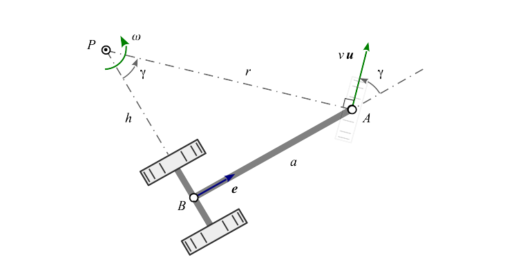
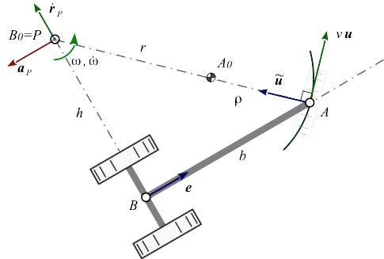
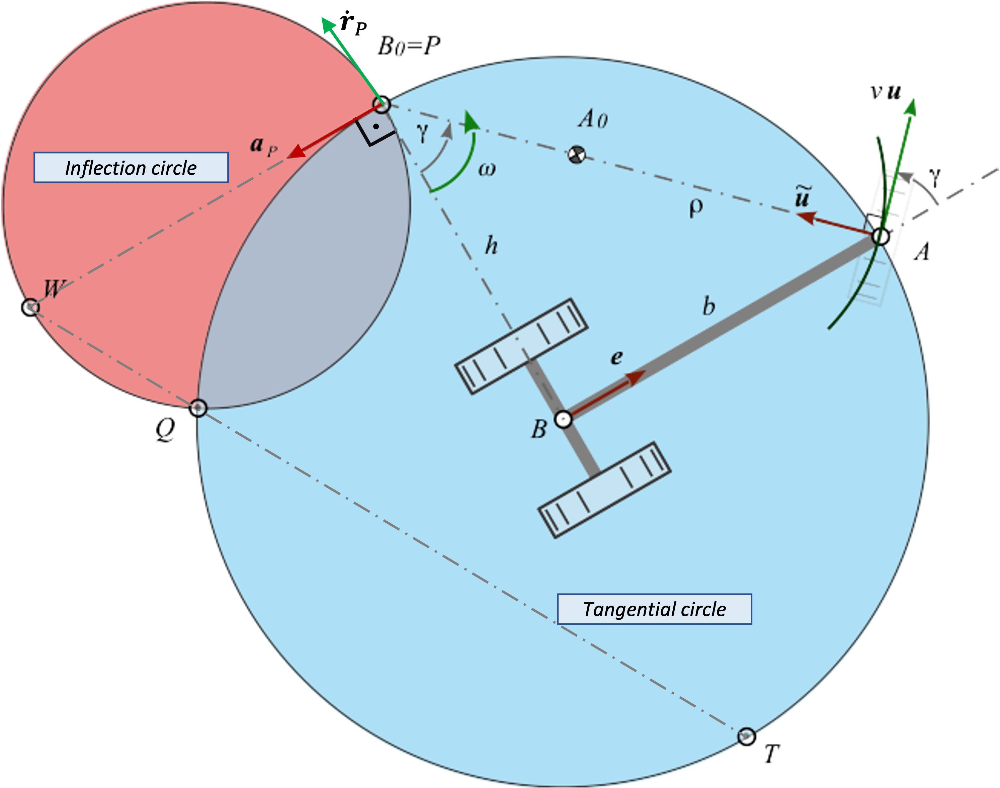
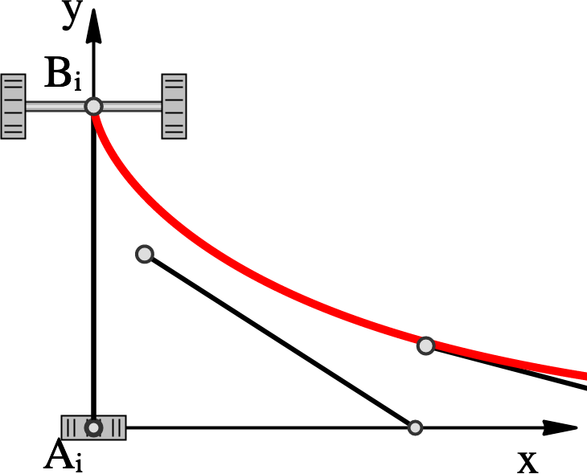
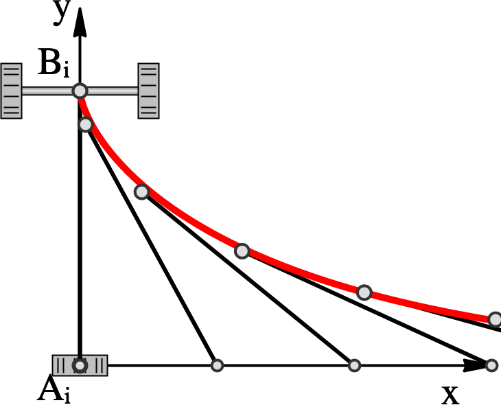
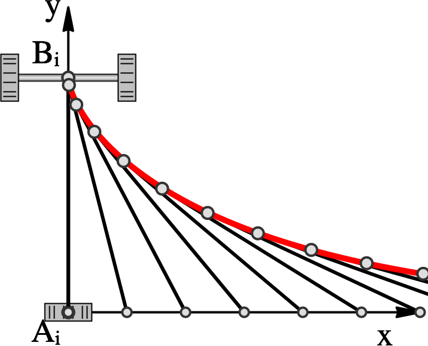

  ## Content

- [Abstract](#abstract)
- [1. Introduction](#1-introduction)
- [2. Geometry](#2-geometry)
- [3. Velocities](#3-velocities)
- [4. Accelerations](#4-accelerations)
- [5. Bresse Circles](#5-bresse-circles)
  - [5.1 Geometric Approach](#51-geometric-approach)
  - [5.2 Kinematic Approach](#52-kinematic-approach)
- [6. Time Integration](#6-time-integration)
- [7. Error Analysis](#7-error-analysis)
- [8. Examples](#8-examples)
- [9. Conclusion](#9-conclusion)
- [References](#references)

### Abstract

This paper investigates the dragging behavior of vehicles using planar rigid-body kinematics. In this context, a kinematic analysis of the single-track model of a vehicle results in a numerical method based on the motion study of a planar four-bar mechanism.  
The driving behavior reproduces the slip-free (slow) motion with a steered front-wheel and a fixed rear-wheel. The generated trajectories are compared to the analytical tractrix in terms of an error analysis.  
The results are used to develop an interactive web application, which allows to interactively guide vehicles or vehicle groups of different dimensions along an arbitrary track, for example to dimension the necessary driving paths.

## 1. Introduction

In general, aspects of vehicle dynamics have to be considered in the trajectory planning of wheeled vehicles [[1]](#1) [[2]](#2). However, in the design of public and internal transport routes these dynamic influences are of minor importance and are usually not taken into account. In such cases it is sufficient to discuss the motion from a purely kinematic point of view &ndash; like so in this paper.

Furthermore, it is common and suitable to restrict a kinematic study of motion in the plane using a two-wheel model and a slip-free rolling of the wheels [[3]](#3) [[4]](#4). This makes a fixed point of the vehicle model explicit guided, either by an analytically given path or drawn by a towing vehicle ahead. Apart from the known position, the determination of the unknown orientation of the vehicle axis remains. 

The mathematical literature classifies the present situation as chase or chasing problem. In this context, the towed point of the non-steered rear axis follows the guiding point of the steered front axis. Between both points exists a kinematic equation, which in general is non-holonomic and therefore not integrable.

Now it can be shown that the combination with a further holonomic relation &ndash; the constant distance between the two points &ndash; in total a holonomic binding exists, which is indeed integrable [[5]](#5) [[6]](#6).

The said integration leads to the trajectory curves or tractrix, namely a linear or circular one, depending on whether it is guided on a straight line or on a circular path. A method based directly on the tractrix is presented in [[4]](#4).

With numerical time integrators for the present initial value problem we distinguish between explicit, implicit and semi-implicit methods. In enhancement of those velocity-centered methods, the angular acceleration will also be considered in this contribution. For this purpose, the Bresse circles of the vehicle motion will be determined geometrically on the one hand and kinematically on the other hand.

The vehicle can be seen as the coupler of a four-bar mechanism. In the following vectors are printed in bold. Apart from the scalar product $\bold{ab}$ also the symplectic inner product $\bold{\tilde ab}$ together with the orthogonal operator (~) is used wisely [[7]](#7) [[8]](#8).

## 2. Geometry

Consider a one-axis trailer moving in the plane, which is drawn by hand, by a car or a truck in point $A$ (figure 1). Its direction of motion relative to the vehicle's longitudinal axis is given by angle $\gamma$ &ndash; think of its steer angle. Its speed, which is the amount of velocity $\bold v$, is considered constant throughout this text.

<figure>
  
  <figcaption>Figure 1: Vehicle Motion</figcaption>
</figure>

When the relative angle $\gamma$ is kept constant, the vehicle will perform a pure rotation about its stationary velocity pole $P$ by constant angular velocity $\omega$. In addition to the movement direction unit vector ${\bold u}$ the vehicle's current position and orientation in the plane is known as well as length $b$ of the rigid link &ndash; known as *drawbar* &ndash; connecting guiding point $A$ and the back wheel axis point $B$ [[4]](#4). So given is:

> * ${\bold u}$ &nbsp;&nbsp;&nbsp;&nbsp; steering unit vector   
> * ${\bold e}$ &nbsp;&nbsp;&nbsp;&nbsp; longitudinal axis unit vector
> * $b$ &nbsp;&nbsp;&nbsp;&nbsp; drawbar length

The location of the instantaneous center of rotation, also called *velocity pole* $P$ seen from steering point $A$ reads

$${\bold r}_{PA} = \bold r_A - \bold r_P\,.$$ (1)

Since vector ${\bold r}_{PA}$ is always directed orthogonal to moving unit direction $\bold u$ of point $A$, we are able to express that relationship as 

$${\bold r}_{PA} = - r\,\tilde{\bold u}\,,$$ (2)

while $r$ is short for $r_{PA}$. Formulating the loop closure equation of triangle $\Delta PAB$ in figure 1 ${\bold r}_{PA} + {\bold r}_{AB} + {\bold r}_{BP} = \bold 0$ yields

$$-r\,\tilde{\bold u} - b\,{\bold e} + h\,\tilde{\bold e} = \bold 0\,.$$ (3)

Multiplying equation (3) by $\bold e$, alternatively by $\bold u$ and finally squaring it gives 

$$r\sin\gamma = b\,,\quad \tan\gamma = \frac{b}{h} \quad and \quad r^2 = b^2 + h^2\,,$$ (4)

while using $\sin\gamma = \tilde{\bold e}{\bold u}$ and $\cos\gamma = {\bold e}{\bold u}$. A closer look at Figure 1 makes the geometric relationships (4) immediately obvious.

Please note, as drawbar length $b$ is always positive and angle $\gamma$ can get positive and negative, that means, that $r$ as well as $h$ might get a negative value together with $\gamma$ also.

## 3. Velocities

We find the velocities by differentiating equation (1) with respect to time.

$${\bold v}_A = {\bold v}_P + \omega\,\tilde{\bold r}_{PA}$$ (5)

Herein $\omega$ is the vehicle's angular velocity. The velocity ${\bold v}_{A} = v\,\bold u$ of the guiding point $A$ is given. The velocity ${\bold v}_{P}$ of the pole &ndash; assumed as a point rigidly connected to the vehicle &ndash; is known to be zero. Reusing equations (2) and  (3) in (5) gives us

$${\bold v}_A = v\,{\bold u} = \omega\, (b\,\tilde{\bold e} + h\,{\bold e})\,.$$ (6)

In order to resolve for $\omega$ we multiply this equation by $\tilde{\bold e}$, i.e.

$$\omega = \frac{v}{b} \sin\gamma\,.$$  (7)

Angular velocity is zero with $\gamma = 0$, when the vehicle performs a pure translation.

## 4. Accelerations

Deriving velocities (5) with respect to time leads us to the accelerations.

$${\bold a}_{A} = {\bold a}_P + \dot\omega\,\tilde{\bold r}_{PA} - \omega^2\,{\bold r}_{PA}$$ (8)

Despite the fact, that the pole has zero velocity, this is not necessarily the case for the pole acceleration ${\bold a}_{P}\,.$ When we take the time derivative of equation (6) 

$${\bold a}_{A} = \omega \dot h\,\bold e + \dot\omega\,\tilde{\bold r}_{PA} - \omega^2\,{\bold r}_{PA}$$ (9)

and subtract equation (7) from (6), we find with

$${\bold a}_P = \omega \dot h\,\bold e$$ (10)

a nice expression for the pole acceleration. Following a suggestion of Dizioglu [[9]](#9), we introduce equation (1) into (4) while getting ${\bold v}_{A} = \omega\,(\tilde{\bold r}_A - \tilde{\bold r}_P)$, then differentiate it w.r.t. time and yield

$${\bold a}_{A} = \dot\omega\,(\tilde{\bold r}_A - \tilde{\bold r}_P) + \omega\,{\dot{\tilde{\bold r}}}_A - \omega\,{\dot{\tilde{\bold r}}}_P\,.$$

Please note, that this time the pole is considered *not fixed* to the vehicle. Recombining ${\bold r}_{PA}  = \bold r_A - \bold r_P$ and using ${\bold v}_{A} = {\dot{\tilde{\bold r}}}_A$ yields

$${\bold a}_{A} = - \omega\,{\dot{\tilde{\bold r}}}_P + \dot\omega\,{\tilde{\bold r}}_{PA} - \omega^2\,{\bold r}_{PA}\,.$$ (11)

Yet subtracting equation (11) from (9) we find an expression for the term ${\dot{\bold r}}_P\,,$ which we call *pole transfer velocity*

$${\dot{\bold r}}_P = \dot h\,\tilde{\bold e}\,.$$ (12)

Please note that equations (10) and (12) conform to the well known fact, that pole transfer velocity and pole acceleration are always oriented orthogonal to each other.

> The direction of the *pole transfer velocity* ${\dot{\bold r}}_P$ coincides with the direction of the *pole tangent*, here directed orthogonal to the vehicle's longitudinal axis. The *pole acceleration* $\bold a_P$ is directed along the direction of the *pole normal*, which is in parallel to the longitudinal axis.

## 5. Bresse Circles

Points on the moving vehicle, which are running through inflection points of their path at current, are lying on the *inflection circle*. They only have normal acceleration, no tangential acceleration. On the other hand, points only having tangential acceleration and no normal acceleration are located on the *tangential circle*.

*Inflection circle* and *tangential circle* together are called "Bresse circles".

Before discussing point $A$ travelling along an arbitrary curve, we start by considering the special cases, where point $A$ is moving on a straight line or on a circle.

<figure>
  
  <figcaption>Figure 2: Vehicle Motion travelling along a circular arc.</figcaption>
</figure>

In both cases we demand guiding point $A$ moving with constant speed $v$. So point $A$ in the circular case only has normal acceleration and in the straight line case it is completely acceleration-free.

### 5.1 Geometric Approach

According to Figure 2 we are able to interprete the vehicle being represented by the coupler of a virtual four-bar mechanism. The crank's fixed point $A_0$ is located in the arc's center of curvature with radius $\rho$ then. The rocker's fixed point $B_0$ always coincides with the vehicle's instantaneous center of rotation $P$. That way we are allowed to apply a geometric approach while analyzing the vehicle motion.

The location of the inflection pole $W$ seen from the pole $P$ is determined in a pure geometric way ([[10]](#10)) via 

$${\bold r}_{PW} = \frac{1}{\tilde{\bold r}_{PA}{\bold r}_{PB}} \Bigg(r_{PB}^2\bigg(\frac{r_{PB}^2}{\tilde{\bold r}_{BB_0}{\bold r}_{PB}} + 1\bigg)\tilde{\bold r}_{PA} - r_{PA}^2\bigg(\frac{r_{PA}^2}{\tilde{\bold r}_{AA_0}{\bold r}_{PA}} + 1\bigg)\tilde{\bold r}_{PB}\Bigg)\,.$$ (13)

From Figure 2 we formulate the required vectors more concretely (Table 1),

  <figcaption>Table 1: Geometric Relations</figcaption>

| ${\bold r}_{AA_0}$ | ${\bold r}_{BB_0}$ | ${\bold r}_{PA}$ | ${\bold r}_{PB}$ |
|:--:|:--:|:--:|:--:|
| $\rho\tilde{\bold u}$ | $-h\tilde{\bold e}$ | $-r\tilde{\bold u}$ | $h\tilde{\bold e}$ |

with which equation (13) &ndash; by reusing trigonometric relation $\sin\gamma = \tilde{\bold e}{\bold u}$ again &ndash; simplifies to

$${\bold r}_{PW} = \frac{r}{\sin\gamma} \bigg(1 - \frac{r}{\rho}\bigg){\bold e}\,.$$ (14)

That useful expression (14) for the inflection pole position seen from the pole is conforming to the fact, that the inflection pole is located on the pole normal [[11]](#11), i.e. lying always on a parallel line to the vehicle's drawbar through the pole. Figure 3 will clarify this.

<figure>
  
  <figcaption>Figure 3: Bresse Circles of the vehicle model.</figcaption>
</figure>

${\bold r}_{PW}$ is the diameter vector of the inflection circle. It becomes infinite, if $\gamma = 0$, thus vehicle motion is a pure translation.

Also note, that radius $\rho$ is a signed value, as is $r$. If $A_0$ and $P$ are lying on the same side on the pole-ray with respect to $A$ they do have equal signs, otherwise they don't. In the special case $\rho = r$ the inflection circle collapses into a single point &ndash; the pole. The vehicle performs a stationary rotation about the pole then.

The condition for $A$ lying on the inflection circle is [[10]](#10)

$${\bold r}_{PW}{\bold r}_{PA} = \bold r_{PA}^2\,.$$

Taking ${\bold r}_{PA}$ from equation (2) and ${\bold r}_{PW}$ from (14) will &ndash; after inserting &ndash; result in $\dfrac{r}{\rho} = 0$, which is true only, if point $A$ is moving on a straight line momentarily and $\rho$ goes to infinity then. So with $A$ moving along a straight line, equation (14) simplifies to

$${\bold r}_{PW} = \frac{r}{\sin\gamma} {\bold e}\,.$$ (15)

Given that point $A$ is moving with constant speed $v$, it has to lie on the tangential circle &ndash; together with all other points having no tangential acceleration.

The location of the tangential pole $T$ seen from the pole $P$ can be written as a pure geometric expression then again [[10]](#10)

$${\bold r}_{PT} = \frac{r_{PA}^2}{\tilde{\bold r}_{PW}{\bold r}_{PA}}\tilde{\bold r}_{PW} $$

Reusing ${\bold r}_{PA}$ and ${\bold r}_{PW}$ from equations (2) and(14) gives

$${\bold r}_{PT} = -\frac{r}{\cos\gamma}\tilde{\bold e}\,.$$ (16)

In the case of $\gamma = 0$ tangential circle's radius goes to infinity together with the pole. When $\gamma = \pm {\pi \over 2}\,$ the pole coincides with drag point $B$ and tangential circle's radius becomes infinite again, due to $\cos\gamma = 0$.  

### 5.2 Kinematic Approach

Any point $E$ on a moving plane currently running through an inflection point of its path has no normal acceleration at current. So velocity ${\bold v}_E$ and acceleration ${\bold a}_E$ are collinear, i.e.

$${\bold a}_E\tilde{\bold v}_E = \bold 0$$

Inserting equations (5) and (8) applied to point $E$, seen from the pole $P$  and multiplying leads to the quadratics

$${\bold r}_{PE}^2 - \frac{{\bold a}_P}{\omega^2}{\bold r}_{PE} = \bold 0\,.$$

Completing the square results in 

$$({\bold r}_{PE} - \frac{{\bold a}_P}{2\omega^2})^2 = \frac{a_P^2}{4\omega^4}\,,$$

which has the shape $(\bold p - {\bold p}_0)^2 = R^2$ of a circle equation in vector notation. The second term in the parentheses is the vector to the circle center. So the opposite circle point to the pole $P$  is the inflection pole $W$. Its kinematic equation reads

$${\bold r}_{PW} = \frac{{\bold a}_P}{\omega^2}$$ (17)

having the direction of the pole acceleration.

Now considering another point $D$ on a moving body having no tangential acceleration at current &ndash; thus lying on the tangential circle. Its velocity ${\bold v}_D$ and acceleration ${\bold a}_D$ are orthogonal then.

$${\bold a}_D{\bold v}_D = \bold 0$$

Treating this equation similar to the inflection point above finally results in the tangential pole equation

$${\bold r}_{PT} = \frac{\tilde{\bold a}_P}{\dot\omega}\,.$$ (18)

Now &ndash; in a last step &ndash; by eliminating pole acceleration ${\bold a}_P$ from equations (17) and (18) we get a kinematic relationship between the inflection and tangential pole

$$\dot\omega\,{\bold r}_{PT} = \omega^2\,\tilde{\bold r}_{PW}$$

containing the object of our desire $\dot\omega$. So finally reusing the geometrically derived pole compagnons from equations (15) and (16) as well as angular velocity $\omega$ from expression (7) leads us to an expression for the vehicle's angular acceleration

$$\dot\omega = \frac{v^2}{b^2}\Big(\frac{r}{\rho}-1\Big)\sin\gamma\cos\gamma$$ (19)

With steering angle $\gamma = 0$ and $\gamma = \pm {\pi \over 2}$ the vehicle's angular acceleration is zero.

## 6. Time Integration

Having given position ${\bold r}_A$, const speed $v$ and moving direction $\bold u$ of guiding point $A$ as well as the current curvature radius $\rho$ of its path together with the vehicle's longitudinal axis length $b$ and unit vector $\bold e\,,$ we are able to tell angular velocity $\omega$ and angular acceleration $\dot\omega$ via formulas (7) and (19) derived so far.

Guiding point's position is determined either by an explicitly given curve or by a series of discrete points in the motion plane. Curvature radius $\rho$ is either directly extracted from the given path or interpolated by three consecutive positions of point $A$. That last feature is important in order to allow users guiding the vehicle by hand via a pointing device as well as to connect trailers to a towing vehicle.

Now that motion of point $A$ is explicitly given, time integration for absolute  vehicle orientation $\varphi$ by a time step $\Delta t$ from state $i$ to state $i+1$ is required. This is accomplished via

$$\varphi_{i+1} = \varphi_{i} +  \omega_i \Delta t + \frac{1}{2}\dot\omega_i \Delta t^2\,.$$ (20)

Back wheel axis point ${\bold r}_{B}$ is calculated then by

$${\bold r}_{B_{i+1}} = {\bold r}_{A_{i+1}} - b\begin{pmatrix}\cos\varphi_{i+1}\\\sin\varphi_{i+1}\end{pmatrix}\,.$$ (21)

From here another time step can be done.

## 7. Error Analysis

Just like any numerical method the approximation and its quality made in the previous chapter depends directly on the choose of vehicle's step size $\Delta s$, i.e. distance passed within a time interval $\Delta t$.

As reference we use the tractrix known from the curve theory, which was already found in the 17th century by Christian Huygens. In the $xy$-plane there is an analogy to the vehicle model (figure 1). A given point $B$ representing a heavy point on the $y$-axis, connected by means of an inextensible string of length $b$ with point $A$; its initial position lies in the origin. With movement of $A$ along the $x$-axis &ndash; also called directrix &ndash; the dragged point $B$ describes the curve of the linear tractrix, whose analytic solution is given in its parametric representation

$$x_B = b\,\bigg(\,t-\tanh\,(t)\,\bigg)\qquad and\qquad y_B = \frac{b}{\cosh\,(t)}\ .$$

In order to get an approximate solution, we similarly let our vehicle model move along the $x$-axis. Assuming constant velocity $v$ and a time step normalized to one $\Delta t = 1s$, we obtain a constant step size $\Delta s = \mu\,b$, which stands in relation to vehicle's towing length. Consequently, the distance traveled along $x$-axis is calculated via $s_{i+1} = s_i + \mu\,b$. The time integration for absolute vehicle orientation $\varphi$ according to (20) yields in new coordinates for point $B$ representing back axis

$$\bold B_{i+1} = \begin{pmatrix}s_{i+1}\\0\end{pmatrix} -b\,\begin{pmatrix}\cos\varphi_{i+1}\\\sin\varphi_{i+1}\end{pmatrix}\ .$$

Figure 4 presents the simulated vehicle motion for different step sizes. Comparing both solutions, it can be seen that the deviation from tractrix (red) &nbsp; especially in the first third &nbsp; is large, but quickly converges towards the analytical value.

<figure style="display:flex;flex-wrap:wrap;justify-content:center">
  
  
  
  <figcaption>Figure 4: Approximation of different step sizes. From left to right: &mu; = [1, 0.5, 0.25].</figcaption>
</figure>

## 8. Examples

A live demonstration can be seen online at ... (repository).

Figure 5 shows a simplified, overlong and interactively guided vehicle formation made of a truck with semitrailer. Using the introduced approach allows efficient handling of dragged convoys, which basically consist of multiple vehicles - similar to the model in Figure 1. The longitudinal axis orientation $\bold e$ of the truck in front serves as direction vector $\bold u$ for the trailer behind it. Thus, all required variables according to Section 2 are known, which permits the use of relations (7), (19), (20), and (21).

<figure>
  
  <figcaption>Figure 5: Truck with semitrailer passes traffic circle. Background graphic <a href="#13">[13]</a></figcaption>
</figure>

## 9. Conclusion

A numerical method is presented for analysis of vehicle kinematics and, in particular, dragging behavior, that can also be applied to vehicle assemblies. Assuming a constant guiding velocity on a known trajectory, it is possible by means of vectorial study of the vehicle's Bresse Circles to find expressions for the relevant angular velocity and acceleration.

Time integration based on this method was validated in comparison with the analytical tractrix. It demonstrates high quality, performance and robustness. Applications for simulating vehicle motions such as the purpose of determining space requirements can be easily implemented, especially in the web environment.

### References

[1] S. Breuer und A. Rohrbach-Kerl, Fahrzeugdynamik – Mechanik des bewegten Fahrzeugs. Springer Vieweg, 2015, isbn: 978-3-658-09474-4.  
[2] H. Marzbani et al., „Transient and steady-state rotation center of vehicle dynamics“, International Conference on Knowledge Based and Intelligent Information and Engineering Systems, 2017.  
[3] D. Wang, Trajectory planning for a four-wheel-steering vehicle, 2001. [Online]. Available at: https://www.researchgate.net/publication/3902741. [Last access: 01 July 2021].  
[4] G. Figliolini, Ch. Lanni, [Kinematic Analysis of the Planar Motion of Vehicles when Traveling Along Tractrix Curves](https://www.researchgate.net/publication/314620122_Kinematic_Analysis_of_the_Planar_Motion_of_Vehicles_When_Travelling_Along_Tractrix_Curves), ASME 2015 International Design Engineering Technical Conferences and Computers and Information in Engineering Conference.  
[5] S. Gössner, Ein kinematisches Modell zur Analyse materialflußtechnischer Bewegungsabläufe. Dortmund: Verlag Praxiswissen, 1992, isbn: 3-929443-01-5.  
[6] M. Braun, „Nichtholonome Bindungen und Systeme“, PAMM — Proceedings in Applied Mathematics and Mechanics, 2003 [Online]. Available at: 10.1002.  
[7] R. Berndt, Einführung in die Symplektische Geometrie. Vieweg+Teubner, 1998, isbn: 978-3528031022.  
[8] S. Gössner, Symplectic Geometry for Engineers — Fundamentals, 2019. [Online]. Available at: https://www.researchgate.net/publication/338124384. [Last access: 01 July 2021].  
[9] B. Dizioglu, Getriebelehre - Grundlagen, Vieweg Verlag, 1965.  
[10] S. Gössner, [Mechanismentechnik — Vektorielle Analyse ebener Mechanismen](http://www.logos-verlag.de/cgi-bin/engbuchmid?isbn=4362&lng=deu&id=). Berlin: Logos Verlag, 2017, isbn: 978-3-8325-4362-4.  
[11] J.J. Uicker et al., Theory of Machines and Mechanisms. Oxford Press, 2011, isbn: 978-0190264482.  
[12] M. Harrer und P. Pfeffer et al., Lenkungshandbuch: Lenksysteme, Lenkgefühl, Fahrdynamik von Kraftfahrzeugen. Springer Vieweg, 2013.  
[13] A. Müseler, Photo: Straßwalchen Kreisverkehr, 2018, Lizenz: CC-BY-SA-3.0: https://creativecommons.org/licenses/by-sa/3.0/de/deed.de. [Online]. Available at: http://www.arne-mueseler.com.  

<!-- [4] M. Husty et al., Kinematik und Robotik. Springer, 1997   
[6] S. Gössner, [Cross Product Considered Harmful](http://s.goessner.net/articles/crossProductHarmful.html).   
[8] F. Freundenstein, G. Sandor, Mechanical Design Handbook - Kinematic of Mechanisms, McGraw-Hill, 2006.   
[9] W. Blaschke, H.R. Müller, Ebene Kinematik, Oldenbourg Verlag, 1965.   
[10] H. Stachel, Strophoids – Cubic Curves with Remarkable Properties, 24th Symposium on Computer Geometry SCG 2015.    -->